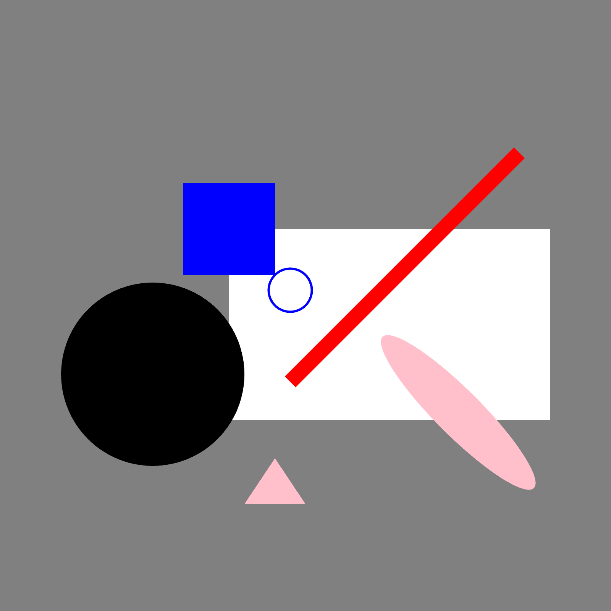
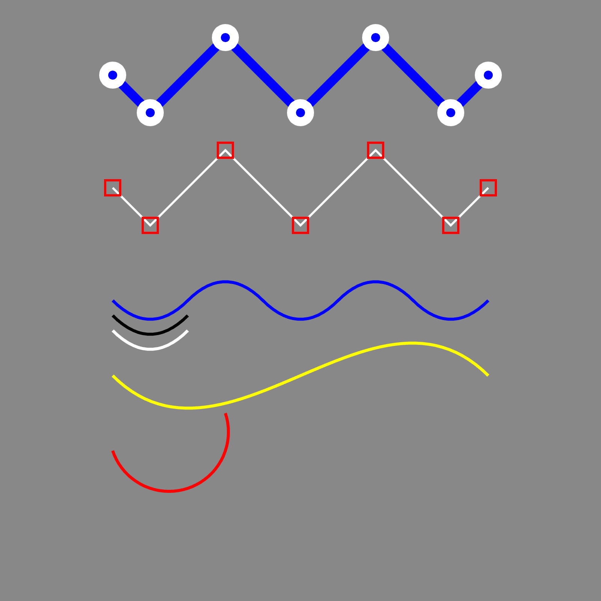
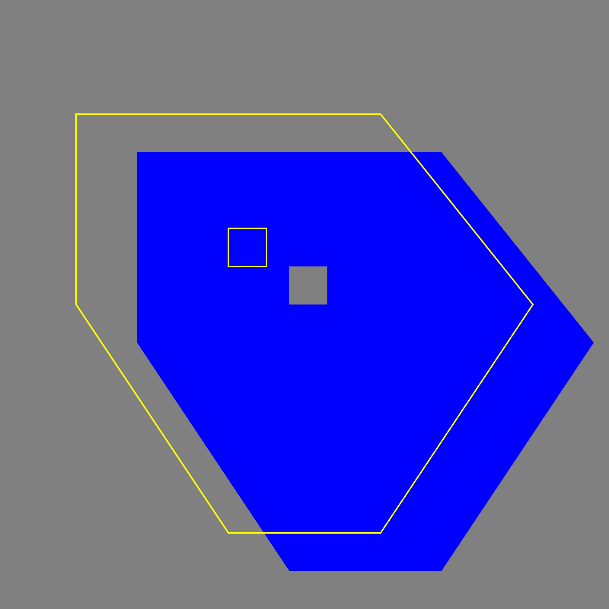

# ssam-thing-examples

A collection of creative coding example sketches using [Ssam.js](https://github.com/cdaein/ssam) and [Thing Umbrella](https://github.com/thi-ng/umbrella).

## How to run

1. Clone this repo.
2. `npm install`
3. `SKETCH=<sketch-file-name> npm run dev`

## Examples

|    source file    |                    result                    |
| :---------------: | :------------------------------------------: |
| `basic-shapes.ts` |    |
|    `paths.ts`     |                  |
|  `paths-hole.ts`  |  |
