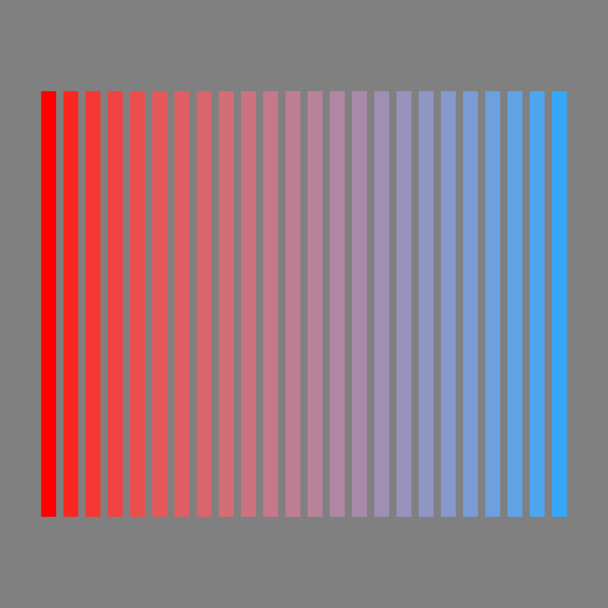

# ssam-thing-examples

A collection of creative coding example sketches using [Ssam.js](https://github.com/cdaein/ssam) and [Thing Umbrella](https://github.com/thi-ng/umbrella).

## How to run

1. Clone this repo.
2. `npm install`
3. `SKETCH=<sketch-file-name> npm run dev`

## Examples

|                 source file                 |                     result                     | notes |
| :-----------------------------------------: | :--------------------------------------------: | :---: |
|   [`basic-shapes`](./src/basic-shapes.ts)   |      |       |
| [`color-gradient`](./src/color-gradient.ts) |  |       |
|     [`image-load`](./src/image-load.ts)     |       |       |
|     [`paths-hole`](./src/paths-hole.ts)     |    |       |
|          [`paths`](./src/paths.ts)          |                    |       |
|     [`svg-export`](./src/svg-export.ts)     |          |       |
|     [`svg-to-canvas`](svg-to-canvas.ts)     |    |       |
